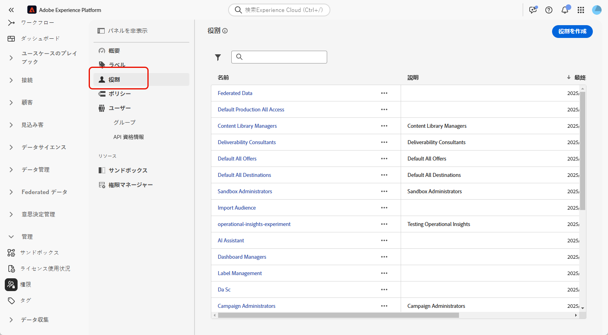
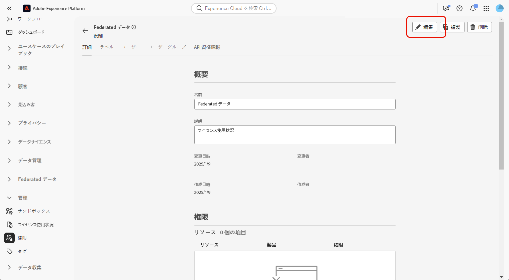
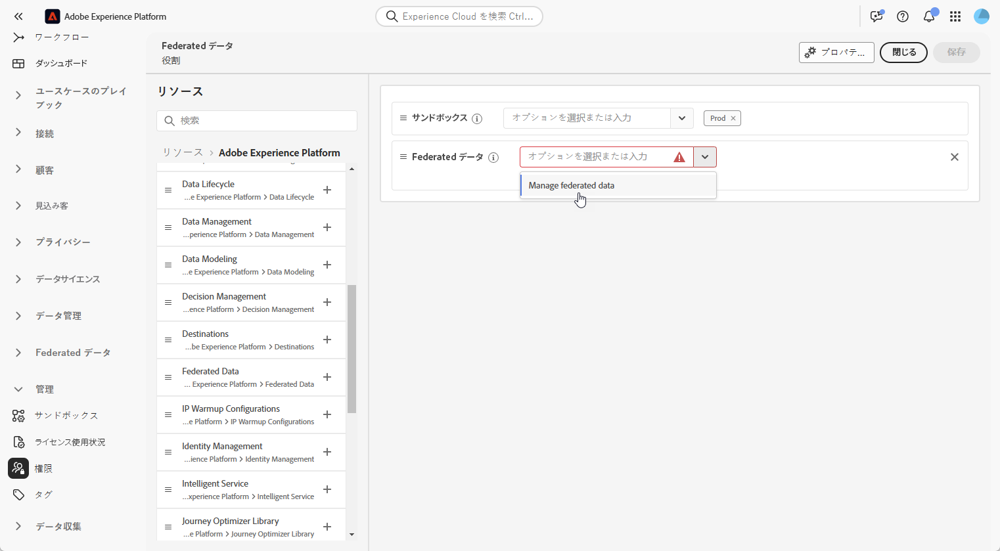
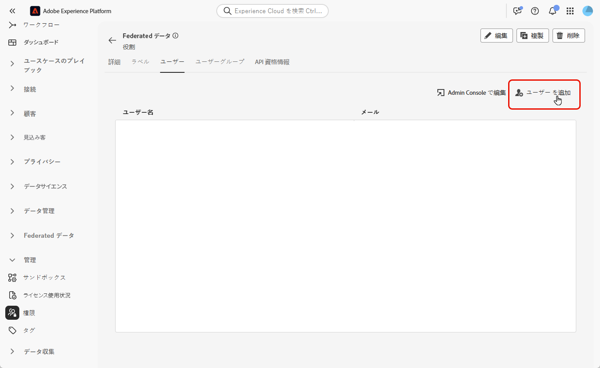

# 連合オーディエンス構成へのアクセス {#feature-access}

## サンドボックスへのアクセスの管理 {#access-sandboxes}

連合オーディエンス構成アドオンを購入すると、この時点でアクティブになっているサンドボックスごとに製品プロファイルが作成されます。この製品プロファイルは、Admin Console の **Adobe Experience Platform** 製品カードの下に作成され、次の命名規則に従います。`ACP_FAC - <<SandboxName>> - admin.` 特定のサンドボックスの連合オーディエンス構成にアクセスするには、このサンドボックス用に作成された製品プロファイルにユーザーを追加する必要があります。

例えば、「fac-test」という名前の新しいサンドボックスをアクティブ化すると、対応する製品プロファイル「ACP_FAC - fac-test - admin」が作成されます。このサンドボックスで連合オーディエンス構成にアクセスするには、ユーザーをこの製品プロファイルに追加する必要があります。

## 連合オーディエンス構成へのアクセスの管理

>[!AVAILABILITY]
>
>権限は 3月のリリースの一部として使用できます。

**連合オーディエンス構成**&#x200B;にアクセスするには、まず&#x200B;**連合データを管理**&#x200B;権限が適切な役割に割り当てられていることを確認する必要があります。次に、これらの役割は、**連合オーディエンス構成**&#x200B;へのアクセスを必要とするユーザーに割り当てる必要があります。

権限を割り当てることができるのは管理者のみです。

1. **[!UICONTROL 権限]**&#x200B;メニューに移動します。

1. **[!UICONTROL 役割]**&#x200B;メニューから、更新する&#x200B;**[!UICONTROL 役割]**&#x200B;を選択します。

   

1. 「**[!UICONTROL 編集]**」をクリックして、役割の権限を変更します。

   

1. **連合データ**&#x200B;のリソースを追加し、ドロップダウンメニューから「**[!UICONTROL 連合データを管理]**」を選択します。

   

1. 必要な変更を行ったら、「**[!UICONTROL 保存]**」をクリックします。

この役割に既に割り当てられているユーザーは、権限が自動的に更新され、連合オーディエンス構成にアクセスできます。

この役割を新しいユーザーに割り当てるには：

1. 役割ダッシュボード内の「**[!UICONTROL ユーザー]**」タブに移動し、「**[!UICONTROL ユーザーを追加]**」をクリックします。

   

1. ユーザーの名前またはメールアドレスを入力するか、使用可能なリストから選択します。完了したら、「**[!UICONTROL 保存]**」をクリックします。

次に、ユーザーはインスタンスにアクセスする手順が記載されたメールを受信します。まだユーザーを作成していない場合は、[このドキュメント](https://experienceleague.adobe.com/ja/docs/experience-platform/access-control/abac/permissions-ui/users)を参照してください。
