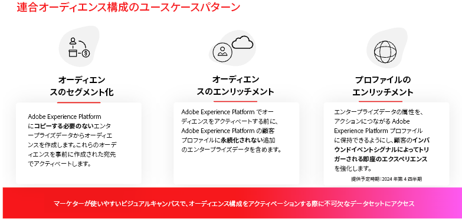

# 連合オーディエンス構成の基本を学ぶ {#gs-fac}

連合オーディエンス構成は、[Adobe Real-time Customer Data Platform](https://experienceleague.adobe.com/ja/docs/experience-platform/segmentation/home){target="_blank"} および [Adobe Journey Optimizer](https://experienceleague.adobe.com/ja/docs/journey-optimizer/using/ajo-home){target="_blank"} のアドオン機能です。サードパーティのデータウェアハウスからオーディエンスを作成して強化し、そのオーディエンスを Adobe Experience Platform に読み込めるようにします。連合オーディエンス構成は、Adobe Real-time Customer Data Platform や Adobe Journey Optimizer 内でエンタープライズデータウェアハウスを直接接続し、データウェアハウスのテーブルに対してクエリを実行するための簡単で強力なソリューションを提供します。

アドビの連合オーディエンス構成は、Adobe Experience Platform アプリのユーザーが、Amazon Redshift、Azure Synapse Analytics などのデータウェアハウスやクラウドストレージプラットフォームに保存されている顧客データにアクセスするのに役立ちます。顧客データを複数のデータウェアハウスに保存し、複製せずに即座にアクセスできるようになります。サポートされているプラットフォームについては、[このページ](../connections/federated-db.md#supported-db)を参照してください。

>[!INFO]
>
>Federated Audience Composition を使用してオーディエンスを作成する方法については、この [ ステップバイステップガイド ](https://experienceleague.adobe.com/en/docs/platform-learn/tutorial-comprehensive-technical/datacollection/module13/fac) に従ってください。

## 機能 {#rn-capabilities}

連合オーディエンス構成は、オーディエンスのキュレーションとアクティベーションに対する包括的なアプローチを用いて、Real-time CDP と Journey Optimizer の価値を拡張します。

* 重要なウェアハウスベースのデータセットへのアクセスを拡張して、価値の高いオーディエンスを作成：既存のデータウェアハウスを主要なレコードシステムとして活用しながら、クラス最高のアプリケーションを活用して優れた顧客体験を実現します。

* エンゲージメントのユースケースを強化するための包括的なサポート：連合オーディエンス構成は、Real-time CDP または Journey Optimizer と組み合わせることで、連合オーディエンスによるブランド主導のパーソナライズされたエクスペリエンスをサポートし、リアルタイムイベントによってトリガーされる瞬間的なエクスペリエンスを、ユーザー属性と組み合わせて提供し、チーム全体のユースケース要件を満たします。

* データの移動と重複を最小化：基になるデータをコピーせずに、エンタープライズデータウェアハウスにあるデータセットからオーディエンスを作成し、実用的なマーケティングプロファイルとオーディエンスを管理します。

* 1 つのシステムをエクスペリエンス駆動型ワークフローに利用：Adobe Experience Platform で取得した連合オーディエンスをキュレーションし、すべてのチャネルにわたってアウトバウンドエクスペリエンスを調整します。

## ユースケース {#rn-uc}

マーケティングに適した UI を通じて、マーケティングキャンペーンに必要な特定のセグメントに該当するユーザーのリストをデータウェアハウスにクエリするためのセグメントルールを作成したり、ウェアハウス内の既存のオーディエンスにアクセスしてアクティベートしたり、ウェアハウス内に存在する追加のデータポイントを使用して Adobe Experience Platform オーディエンスを強化したりすることができます。

このバージョンでは、次の 2 つのユースケースが使用できます。

1. オーディエンスの作成：基になるデータをコピーせずに、エンタープライズデータセットから新しいオーディエンスを作成し、事前に作成された宛先でこれらのオーディエンスをアクティブ化します。

1. オーディエンスのエンリッチメント：エンタープライズデータウェアハウスから連合された構成済みオーディエンスデータを利用して、Adobe Experience Platform の既存のオーディエンスを強化します。このデータは、Adobe Experience Platform の顧客プロファイルには保存されません。

{zoomable="yes"}{width="75%" align="center"}

## 主な手順 {#gs-steps}

アドビの連合オーディエンス構成を使用すると、取り込みプロセスなしで、データベースから直接 Adobe Experience Platform オーディエンスを作成および更新できます。

<!--{zoomable="yes"}{width="85%" align="center"}-->

主な手順：

1. **データ統合**：様々なソースからデータを統合し、統合されたデータセットに結合します。Adobe Experience Platform アプリとエンタープライズデータウェアハウスを接続する方法、サポートされているデータベース、およびこれらの設定方法について詳しくは、[この節](../connections/federated-db.md)を参照してください。

1. **データモデリング**：データの構造、関係、制約を定義するデータモデルとスキーマをデザインおよび作成します。スキーマについて詳しくは、[このページ](../customer/schemas.md)を参照してください。データモデルのリンクを作成する方法については、[このページ](../data-management/gs-models.md)を参照してください。

1. **データ変換**：データ操作テクニックを適用して、データ要素の形式、構造、値を変更し、特定の分析やアプリケーションに対して互換性を持たせたり、適合させたりします。

1. **データ使用**：オーディエンスを作成、調整および構築します。オーディエンスの構成方法については、[このページ](../compositions/gs-compositions.md)を参照してください。また、Adobe Experience Platform オーディエンスポータルと宛先を通じて、既存のオーディエンスを更新または再利用することもできます。詳しくは、[このページ](../connections/destinations.md)を参照してください。

>[!NOTE]
>
>構成を実行すると、結果のオーディエンスが外部オーディエンスとして Adobe Experience Platform に保存され、Adobe Real-time Customer Data Platform や Adobe Journey Optimizer で使用できるようになります。**オーディエンス**&#x200B;メニューでアクセスできます。[詳細情報](https://experienceleague.adobe.com/ja/docs/experience-platform/segmentation/ui/audience-portal){target="_blank"}

## 詳細情報 {#learn}

<!-- Workflow + Workflow activities-->

連合オーディエンス構成、ガードレールおよび制限にアクセスする方法については、[このページ](access-prerequisites.md)を参照してください。

また、[このページ](faq.md)のよくある質問も参照してください。

>[!CONTEXTUALHELP]
>id="dc_workflow_settings_execution"
>title="実行設定"
>abstract="このセクションでは、構成履歴を保持する日数など、ワークフローの実行に関連する設定を指定できます。"

>[!CONTEXTUALHELP]
>id="dc_orchestration_query_enrichment_noneditable"
>title="編集不可のアクティビティ"
>abstract="コンソールで「**クエリ**」アクティビティまたは「**エンリッチメント**」アクティビティに追加のデータを設定する際、エンリッチメントデータが考慮され、アウトバウンドトランジションに渡されますが、編集はできません。"

<!-- Create a link -->

>[!CONTEXTUALHELP]
>id="dc_federated_database_create_link"
>title="リンクの作成"
>abstract="リンク設定を定義します。"

<!-- incremental query IDs -->

>[!CONTEXTUALHELP]
>id="dc_orchestration_incrementalquery"
>title="増分クエリ"
>abstract="「**増分クエリ**」アクティビティを使用すると、クエリモデラーを使用してデータベースにクエリを実行できます。 このアクティビティが実行されるたびに、以前の実行結果が除外されます。 これにより、新しい要素だけをターゲットにすることができます。"

>[!CONTEXTUALHELP]
>id="dc_orchestration_incrementalquery_history"
>title="増分処理クエリ履歴"
>abstract="増分処理クエリ履歴"

>[!CONTEXTUALHELP]
>id="dc_orchestration_incrementalquery_processeddata"
>title="増分クエリの処理済みデータ"
>abstract="増分クエリの処理済みデータ"

>[!CONTEXTUALHELP]
>id="dc_orchestration_incrementalmode_standard"
>title="増分クエリモード"
>abstract="増分クエリを使用すると、新しい実行ごとに以前の実行結果を除外することで、同じクエリを複数回実行できます。"

>[!CONTEXTUALHELP]
>id="dc_orchestration_incrementalmode_custom"
>title="増分クエリモード"
>abstract="増分クエリを使用すると、日付フィールドが増分クエリアクティビティの最後の実行日以降である結果のみを考慮して、同じクエリを複数回実行できます。"

>[!CONTEXTUALHELP]
>id="dc_orchestration_build_audience_dimension"
>title="ターゲティングディメンションの選択"
>abstract="ターゲティングディメンションは、受信者、契約の受益者、オペレーター、サブスクライバーなど、ターゲットされる母集団を操作ごとに定義します。デフォルトでは、メールと SMS の場合、ターゲットは受信者ビルトインテーブルから選択されます。プッシュ通知の場合、デフォルトのターゲットディメンションはサブスクライバーのアプリケーションです。"

<!-- save profile IDs-->

>[!CONTEXTUALHELP]
>id="dc_orchestration_saveprofile"
>title="プロファイルの保存"
>abstract="プロファイルの保存"

>[!CONTEXTUALHELP]
>id="dc_orchestration_saveprofile_selectaepschema"
>title="プロファイルを保存して AEP スキーマを選択"
>abstract="プロファイルを保存して AEP スキーマを選択"

>[!CONTEXTUALHELP]
>id="dc_orchestration_saveprofile_aepschemalist"
>title="プロファイル AEP スキーマリストの保存"
>abstract="プロファイル AEP スキーマリストの保存"

>[!CONTEXTUALHELP]
>id="dc_orchestration_saveprofile_selectaepattribute"
>title="プロファイル AEP スキーマ属性の保存"
>abstract="プロファイル AEP スキーマ属性の保存"

>[!CONTEXTUALHELP]
>id="dc_orchestration_saveprofile_selectprimaryfield"
>title="プロファイルを保存してプライマリ識別フィールドを選択"
>abstract="プロファイルを保存してプライマリ識別フィールドを選択"
