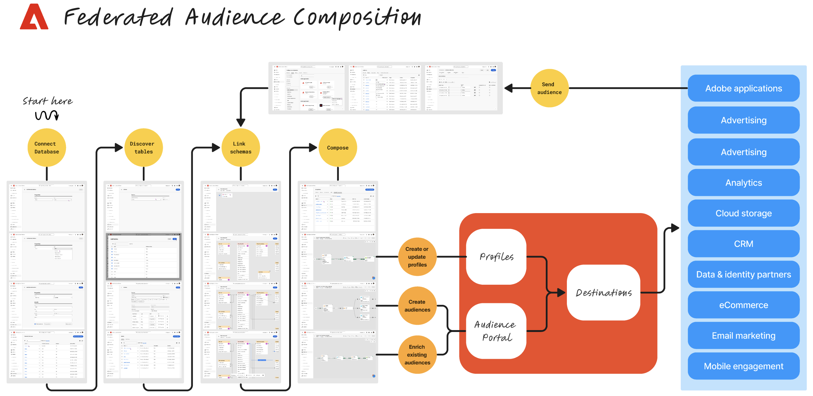

# Federated Audience コンポジションの基本を学ぶ {#gs-fac}

Adobeの Federated Audience Composition は、Adobe Experience Platform アプリのユーザーが、Enterprise Data Warehouse に保存された顧客データにアクセスするのに役立ちます。 お客様のデータは複数のデータ・ウェアハウスに保存でき、レプリケーションを行わずに即座にアクセス可能です。

Adobe Experience Platform Federated Audience Composition は、企業の Data Warehouse をAdobe Real-time Customer Data Platform内に直接接続し、Data Warehouse のテーブルに対するクエリを実行するための簡単で強力なソリューションです。

## 主な手順 {#gs-steps}

Adobeの Federated Audience Composition を使用すると、取り込みプロセスを実行することなく、データベースから直接Adobe Experience Platform オーディエンスを作成および更新できます。

主な手順：

* **設定**

   1. Adobe Experience Platformとエンタープライズ Data Warehouse を接続します。
サポートされているデータベースは、Snowflake、Google Big Query、Azure synapse、Redshift です。
詳しくは、[このページ](../connections/federated-db.md)を参照してください。
   1. スキーマを作成して、ユーザーインターフェイスからアクセスできるデータを選択します。
詳しくは、[このページ](../customer/schemas.md)を参照してください。
   1. データモデルのリンクを作成します。
詳しくは、[このページ](../data-management/gs-models.md)を参照してください。

* **オーディエンスの作成**

   1. オーディエンスを作成するためのコンポジションを設計および実行します。
詳しくは、[このページ](../compositions/gs-compositions.md)を参照してください。
   1. Adobe Experience Platform オーディエンスポータルと Destinations を通じて、既存のオーディエンスを更新または再利用します。
詳しくは、[このページ](../connections/destinations.md)を参照してください。

## 詳細情報 {#learn}

<!-- Workflow + Workflow activities-->

>[!CONTEXTUALHELP]
>id="dc_workflow_settings_execution"
>title="実行設定"
>abstract="このセクションでは、ワークフローの履歴を保持する日数など、ワークフローの実行に関する設定を指定できます。"

>[!CONTEXTUALHELP]
>id="dc_orchestration_query_enrichment_noneditable"
>title="編集不可のアクティビティ"
>abstract="コンソールで「**クエリ**」アクティビティまたは「**エンリッチメント**」アクティビティに追加のデータを設定する際、エンリッチメントデータが考慮され、アウトバウンドトランジションに渡されますが、編集はできません。"

<!-- Create a link -->

>[!CONTEXTUALHELP]
>id="dc_federated_database_create_link"
>title="リンクの作成"
>abstract="リンク設定を定義します。"
