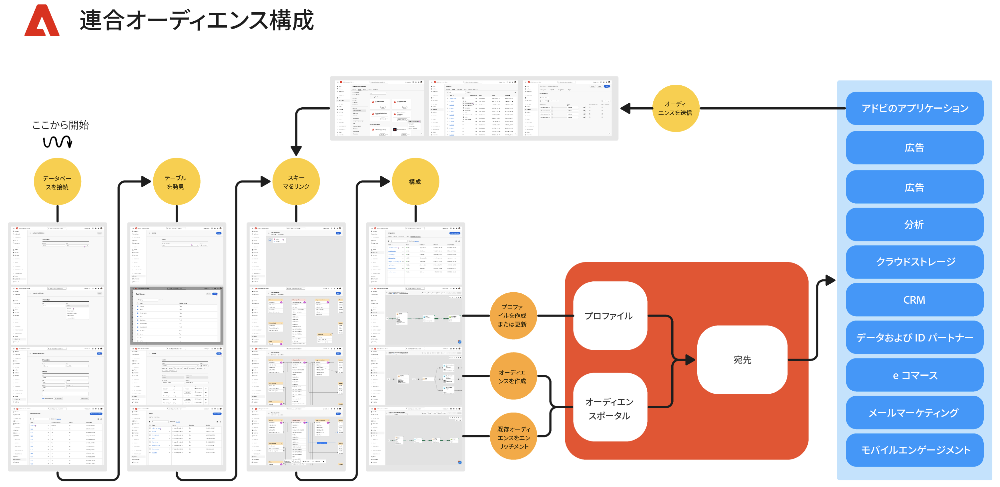

# Federated Audience コンポジションの基本を学ぶ {#gs-fac}

Federated Audience Composition は、サードパーティのデータウェアハウスからオーディエンスを作成して強化し ](https://experienceleague.adobe.com/en/docs/experience-platform/segmentation/home){target="_blank"} そのオーディエンスをAdobe Experience Platformにインポートできる ](https://experienceleague.adobe.com/ja/docs/journey-optimizer/using/ajo-home){target="_blank"}0}Adobe Real-time Customer Data Platform} および [Adobe Journey Optimizer} のアドオン機能です。 [Federated Audience Composition は、Enterprise Data Warehouse をAdobe Real-time Customer Data PlatformやAdobe Journey Optimizer内に直接接続し、Data Warehouse のテーブルに対してクエリを実行するための、簡単で強力なソリューションです。

Adobeの Federated Audience Composition は、Adobe Experience Platform アプリのユーザーが、データウェアハウスや、Amazon Redshift や Cloud Analytics などのクラウドストレージプラットフォームに保存されたAzure synapseデータにアクセスするのに役立ちます。 お客様のデータは複数のデータ・ウェアハウスに保存でき、レプリケーションなしで即座にアクセス可能になります。 サポートされるプラットフォームは [ このページ ](../connections/federated-db.md#supported-db) にリストされています。

## 機能 {#rn-capabilities}

Federated Audience Composition は、オーディエンスのキュレーションとアクティベーションに対する包括的なアプローチを通じて、Real-Time CDPとJourney Optimizerの価値を拡張します。

* 重要なウェアハウスベースのデータセットへのアクセスを拡大して、価値の高いオーディエンスを作成：既存のデータウェアハウスを主要なレコードシステムとして活用しながら、クラス最高のアプリケーションを活用して優れたカスタマーエクスペリエンスを強化します。

* エンゲージメントのユースケースを強化するための包括的なサポート：Federated Audience Composition をReal-Time CDPまたはJourney Optimizerと組み合わせて使用すると、Federated Audiences で、ブランド主導のパーソナライズされたエクスペリエンスをサポートし、リアルタイムイベントでトリガーされたリアルタイムのエクスペリエンスと、チーム全体のユースケース要件を満たすユーザー属性を組み合わせて提供します。

* データの移動と重複を最小限に抑える：基盤となるデータをコピーせずに、エンタープライズデータウェアハウスに存在するデータセットからオーディエンスを作成して、実用的なマーケティングプロファイルとオーディエンスを管理します。

* 1 つのシステムをエクスペリエンス駆動型ワークフローに活用：Adobe Experience Platformで取得したオーディエンスとフェデレーテッド オーディエンスをキュレーションし、すべてのチャネルにわたってアウトバウンドエクスペリエンスを調整します。

## ユースケース {#rn-uc}

マーケティングに対応した UI を使用して、マーケティングキャンペーンに必要な特定のセグメントに適合するユーザーのリストをデータウェアハウスにクエリするセグメントルールを作成したり、アクティブ化のためにウェアハウス内の既存のオーディエンスにアクセスしたり、ウェアハウス内に存在する追加のデータポイントでAdobe Experience Platform オーディエンスをエンリッチメントしたりできます。

このバージョンでは、次の 2 つのユースケースを使用できます。

1. オーディエンスの作成：基になるデータをコピーせずにエンタープライズデータセットから新しいオーディエンスを作成し、事前に作成された宛先でこれらのオーディエンスをアクティブ化&#x200B;

1. オーディエンスの強化：Enterprise Data Warehouse からフェデレーションされた作成済みオーディエンスデータを利用して、Adobe Experience Platformの既存のオーディエンスを強化します。 このデータは、Adobe Experience Platform顧客プロファイルには保持されません。

{zoomable="yes"}{width="75%" align="center"}

## 主な手順 {#gs-steps}

Adobeの Federated Audience Composition を使用すると、取り込みプロセスを実行することなく、データベースから直接Adobe Experience Platform オーディエンスを作成および更新できます。

{zoomable="yes"}{width="85%" align="center"}

主な手順：

1. **データ統合**：様々なソースからのデータを統合し、統合されたデータセットに結合します。 Adobe Experience Platform アプリと Enterprise Data Warehouse を接続する方法、サポートされているデータベース、それらの設定方法について詳しくは、[ この節 ](../connections/federated-db.md) を参照してください。

2. **データモデリング**：データの構造、関係、制約を定義するデータモデルとスキーマを設計および作成します。 スキーマについて詳しくは、[ このページ ](../customer/schemas.md) を参照してください。 データモデルのリンクを作成する方法については、[ このページ ](../data-management/gs-models.md) を参照してください。

3. **データ変換**：データ操作テクニックを適用して、データ要素の形式、構造または値を変更し、特定の分析やアプリケーションに対して互換性や適したものにします。

4. **データ使用**：オーディエンスを作成、オーケストレーションおよび作成します。 オーディエンスを作成する方法については、[ このページ ](../compositions/gs-compositions.md) を参照してください。 また、Adobe Experience Platform Audience ポータルと Destinations を通じて、既存のオーディエンスを更新または再利用することもできます。 詳しくは、[このページ](../connections/destinations.md)を参照してください。

>[!NOTE]
>
>コンポジションを実行すると、結果のオーディエンスが外部オーディエンスとしてAdobe Experience Platformに保存され、Adobeの Real-time Customer Data Platform やAdobe Journey Optimizerで使用できるようになります。 **オーディエンス** メニューでアクセス可能になります。 [詳細情報](https://experienceleague.adobe.com/en/docs/experience-platform/segmentation/ui/audience-portal){target="_blank"}
>

## 詳細情報 {#learn}

<!-- Workflow + Workflow activities-->

[ このページ ](faq.md) の「よくある質問」を参照してください。

>[!CONTEXTUALHELP]
>id="dc_workflow_settings_execution"
>title="実行設定"
>abstract="このセクションでは、コンポジション履歴を保持する日数など、ワークフローの実行に関する設定を指定できます。"

>[!CONTEXTUALHELP]
>id="dc_orchestration_query_enrichment_noneditable"
>title="編集不可のアクティビティ"
>abstract="コンソールで「**クエリ**」アクティビティまたは「**エンリッチメント**」アクティビティに追加のデータを設定する際、エンリッチメントデータが考慮され、アウトバウンドトランジションに渡されますが、編集はできません。"

<!-- Create a link -->

>[!CONTEXTUALHELP]
>id="dc_federated_database_create_link"
>title="リンクの作成"
>abstract="リンク設定を定義します。"
