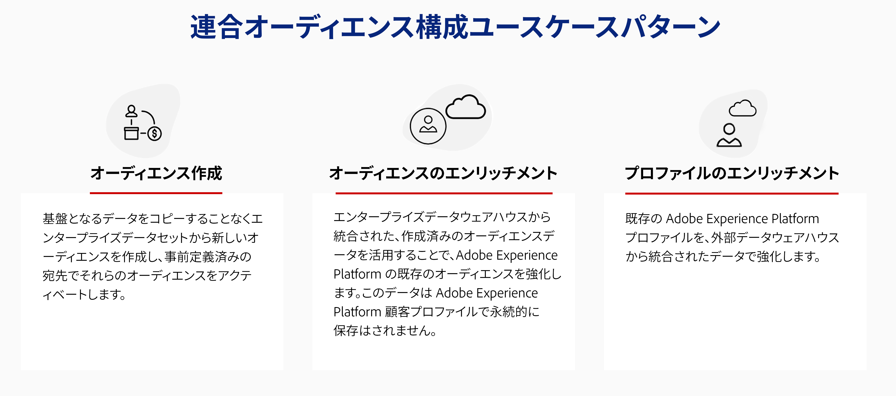

# Federated Audience コンポジションの基本を学ぶ {#gs-fac}

Federated Audience Composition は、サードパーティのデータウェアハウスからオーディエンスを作成して強化し、そのオーディエンスをAdobe Experience Platformにインポートできる、Adobe Real-time Customer Data PlatformおよびAdobe Journey Optimizer向けのアドオンです。 Federated Audience Composition は、Enterprise Data Warehouse をAdobe Real-time Customer Data PlatformやAdobe Journey Optimizer内に直接接続し、Data Warehouse のテーブルに対してクエリを実行するための、簡単で強力なソリューションです。

Adobeの Federated Audience Composition は、Adobe Experience Platform アプリのユーザーが、データウェアハウスや、Amazon Redshift や Cloud Analytics などのクラウドストレージプラットフォームに保存されたAzure synapseデータにアクセスするのに役立ちます。 お客様のデータは複数のデータ・ウェアハウスに保存でき、レプリケーションなしで即座にアクセス可能になります。 サポートされるプラットフォームは [ このページ ](../connections/federated-db.md#supported-db) にリストされています。

## ユースケース {#rn-uc}

マーケティングに対応した UI を使用して、マーケティングキャンペーンに必要な特定のセグメントに適合するユーザーのリストをデータウェアハウスにクエリするセグメントルールを作成したり、アクティブ化のためにウェアハウス内の既存のオーディエンスにアクセスしたり、ウェアハウス内に存在する追加のデータポイントでAdobe Experience Platform オーディエンスをエンリッチメントしたりできます。

このバージョンでは、オーディエンスのセグメント化とオーディエンスのエンリッチメントの 2 つのユースケースを使用できます。 プロファイルのエンリッチメントは、今後のリリースで利用可能になる予定です。

{zoomable="yes"}

## 主な手順 {#gs-steps}

Adobeの Federated Audience Composition を使用すると、取り込みプロセスを実行することなく、データベースから直接Adobe Experience Platform オーディエンスを作成および更新できます。

{zoomable="yes"}

主な手順：

1. **データ統合**：様々なソースからのデータを統合し、統合されたデータセットに結合します。 Adobe Experience Platform アプリと Enterprise Data Warehouse を接続する方法、サポートされているデータベース、それらの設定方法について詳しくは、[ この節 ](../connections/federated-db.md) を参照してください。

2. **データモデリング**：データの構造、関係、制約を定義するデータモデルとスキーマを設計および作成します。 スキーマについて詳しくは、[ このページ ](../customer/schemas.md) を参照してください。 データモデルのリンクを作成する方法については、[ このページ ](../data-management/gs-models.md) を参照してください。

3. **データ変換**：データ操作テクニックを適用して、データ要素の形式、構造または値を変更し、特定の分析やアプリケーションに対して互換性や適したものにします。

4. **データ使用**：オーディエンスを作成、オーケストレーションおよび作成します。 オーディエンスを作成する方法については、[ このページ ](../compositions/gs-compositions.md) を参照してください。 また、Adobe Experience Platform Audience ポータルと Destinations を通じて、既存のオーディエンスを更新または再利用することもできます。 詳しくは、[このページ](../connections/destinations.md)を参照してください。

## 詳細情報 {#learn}

<!-- Workflow + Workflow activities-->

[ このページ ](faq.md) の「よくある質問」を参照してください。

>[!CONTEXTUALHELP]
>id="dc_workflow_settings_execution"
>title="実行設定"
>abstract="このセクションでは、コンポジション履歴を保持する日数など、ワークフローの実行に関する設定を指定できます。"

>[!CONTEXTUALHELP]
>id="dc_orchestration_query_enrichment_noneditable"
>title="編集不可のアクティビティ"
>abstract="コンソールで「**クエリ**」アクティビティまたは「**エンリッチメント**」アクティビティに追加のデータを設定する際、エンリッチメントデータが考慮され、アウトバウンドトランジションに渡されますが、編集はできません。"

<!-- Create a link -->

>[!CONTEXTUALHELP]
>id="dc_federated_database_create_link"
>title="リンクの作成"
>abstract="リンク設定を定義します。"
